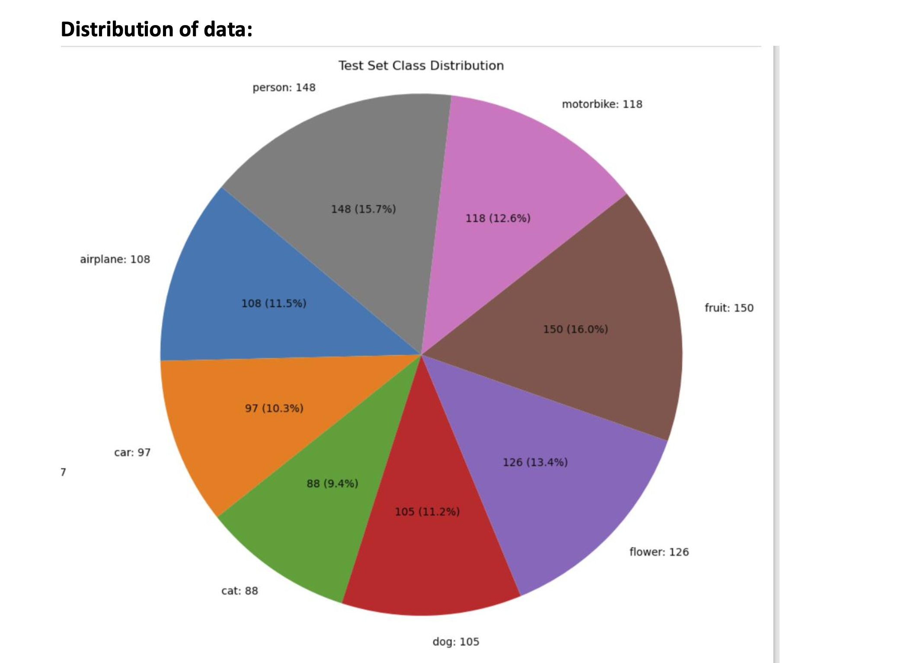
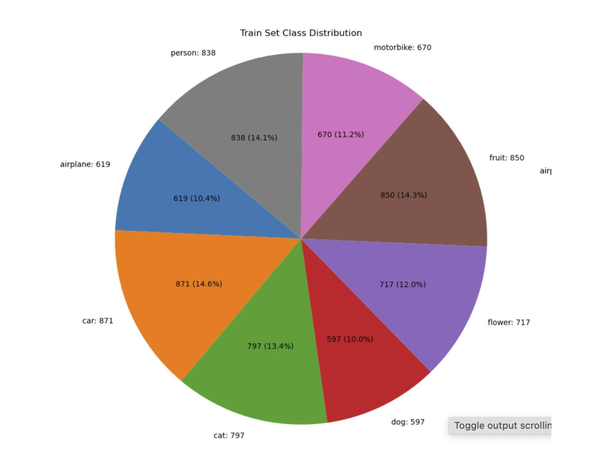
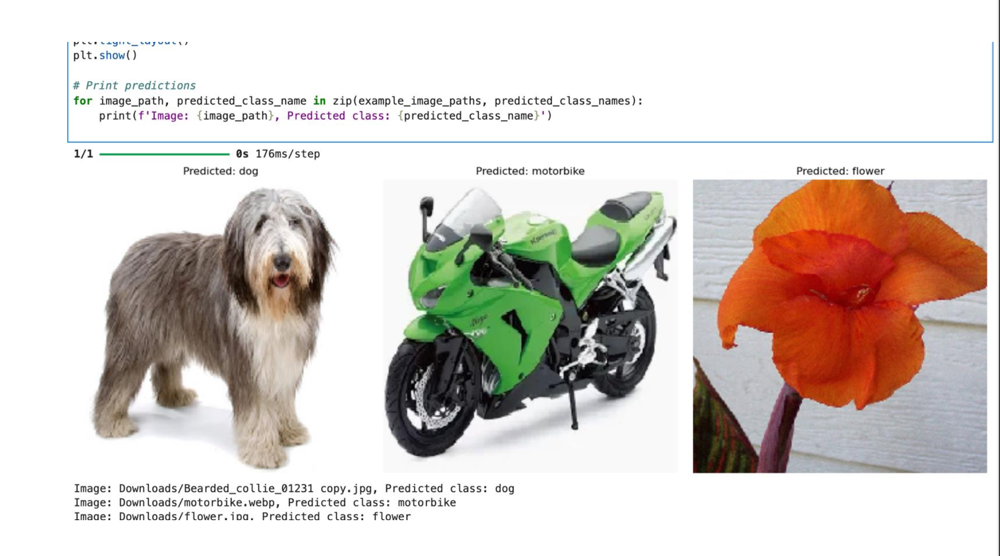
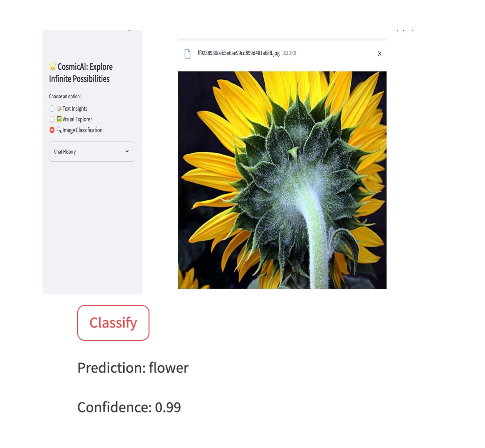
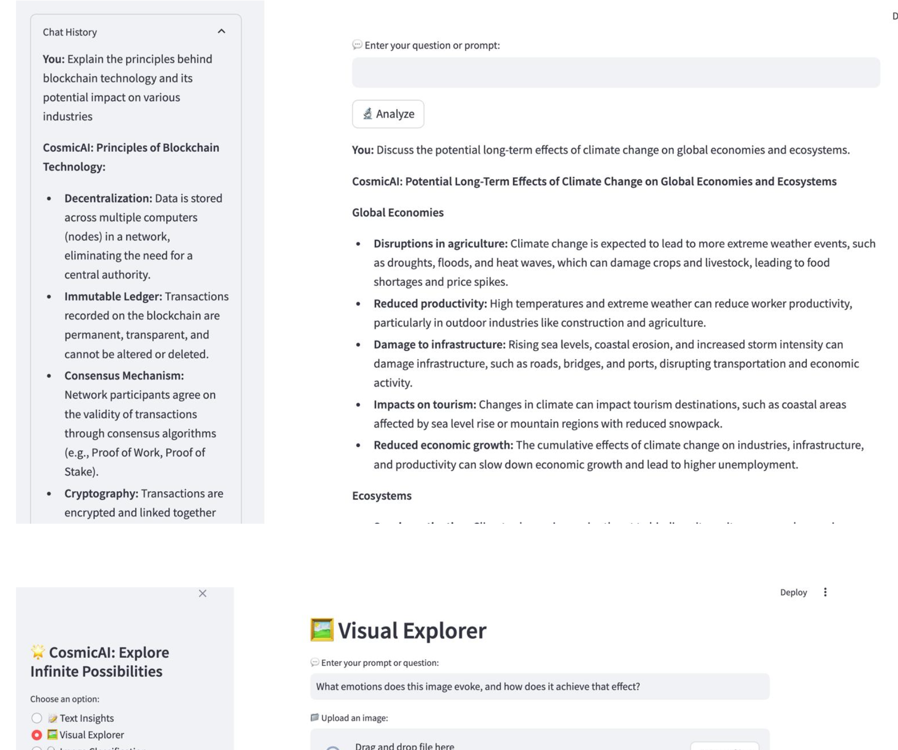

Here's a professional, graduate-level README.md for your GitHub portfolio project:

---

# Image Classification Project using ResNet50 and Streamlit

## Abstract

This project involves developing an advanced image classification system leveraging deep learning techniques, specifically the ResNet50 architecture, and integrating it with a user-friendly Streamlit application. The project demonstrates the application of transfer learning, extensive data augmentation, and integration with generative AI models to enhance functionality and user experience.

## Introduction

Image classification is a crucial task in computer vision, involving categorizing and labeling images based on their content. This project utilizes ResNet50, a deep residual network known for its effectiveness and accuracy in image classification tasks, and Streamlit, an open-source Python library, to create an interactive web application for model deployment.

### Objectives

- Implement ResNet50 for accurate image classification.
- Develop a user-friendly Streamlit application for model interaction.
- Integrate generative AI for advanced image and text analysis.

## Image Classification Fundamentals

### What is Image Classification?

Image classification involves assigning labels to images based on their content using convolutional neural networks (CNNs). ResNet50, with its 50-layer architecture, is utilized for its ability to learn deep representations and achieve high accuracy.

### Applications

Image classification is applied in various fields, including healthcare, autonomous systems, retail, security, and environmental monitoring, enabling tasks such as disease diagnosis, object recognition, and surveillance.

### Advantages and Challenges

**Advantages:** High accuracy, scalability, automation, and versatility.  
**Challenges:** Data dependency, computational intensity, vulnerability to attacks, and interpretability issues.

## Project Overview

This project aims to develop a robust image classification system using the ResNet50 model, fine-tuned on a custom dataset. The project incorporates data augmentation techniques and integrates a Streamlit-based user interface for enhanced user interaction.

### Dataset

The dataset consists of images organized into training, validation, and test sets, stored in a structured directory format essential for data loading and augmentation using TensorFlow's ImageDataGenerator.

### Data Preparation

Effective data preparation involves image preprocessing and augmentation to improve the model's generalization capabilities. Images are resized to 224x224 pixels and normalized. Data augmentation techniques include horizontal flipping, zooming, shifting, shearing, and rotation.

## Model Development

### Transfer Learning with ResNet50

Transfer learning leverages the pre-trained ResNet50 model on the ImageNet dataset. Initial layers are frozen to retain learned features, while custom layers (GlobalAveragePooling2D, Dropout, Dense Layers) are added for the specific classification task.

### Compiling the Model

The model is compiled with the Adam optimizer, categorical cross-entropy loss function, and accuracy metric. Callbacks for learning rate scheduling and early stopping enhance the training process.

### Training and Fine-tuning

The model is initially trained with frozen base layers, followed by fine-tuning with lower learning rates to improve performance. This approach balances retaining learned features and adapting to the new dataset.

## Evaluation and Results

The model's performance is evaluated on the test set, with metrics such as loss and accuracy computed. Visualizations of training/validation accuracy and loss over epochs help in understanding training dynamics.

### Result and Visualization

Plots showcasing the model's accuracy and loss are included, along with an analysis of class distribution and potential biases.

## Integration with Streamlit Application

### User Interaction

The Streamlit application provides an interactive platform for users to upload images and receive classification results. The interface includes features for detailed analysis and user interaction.

### Generative AI Integration

Generative AI models (e.g., Gemini Pro Vision for image analysis and Gemini Pro for text insights) are integrated to enhance the application's capabilities, offering users deeper insights and comprehensive interaction options.

## Novelty and Potential Improvements

### Hybrid Model Approach

Innovative aspects include unique data augmentation strategies, regularization techniques, and a confidence threshold mechanism to handle uncertain samples. The user-centric design adds practical value to the project.

### Potential Improvements

Future directions include exploring different pretrained models (e.g., InceptionV3, ResNet101), expanding the dataset for better generalization, and improving the application interface.

## Feasibility Study

### Technical Feasibility

The project utilizes established Python libraries (TensorFlow, Keras) and runs on personal laptops, demonstrating technical feasibility without specialized hardware.

### Economic Feasibility

Using open-source libraries and tools ensures no direct costs, making the project economically feasible.

### Time Feasibility

The project acknowledges longer processing times due to computational demands but remains feasible within typical development timelines.

## Conclusion

This project demonstrates the potential of deep learning and generative AI in developing robust image classification systems. The combined approach of using transfer learning, data augmentation, and an interactive AI-powered application highlights the project's technical rigor and practical value.

## Future Work

Potential enhancements include exploring additional pretrained models, expanding the dataset, and refining the Streamlit application for better user experience.

## Acknowledgements

https://www.tensorflow.org/

https://arxiv.org/pdf/1512.03385
https://towardsdatascience.com/the-annotated-resnet-50-a6c536034758
https://www.kaggle.com
https://cloud.google.com/ai/generative-ai
https://streamlit.io/
